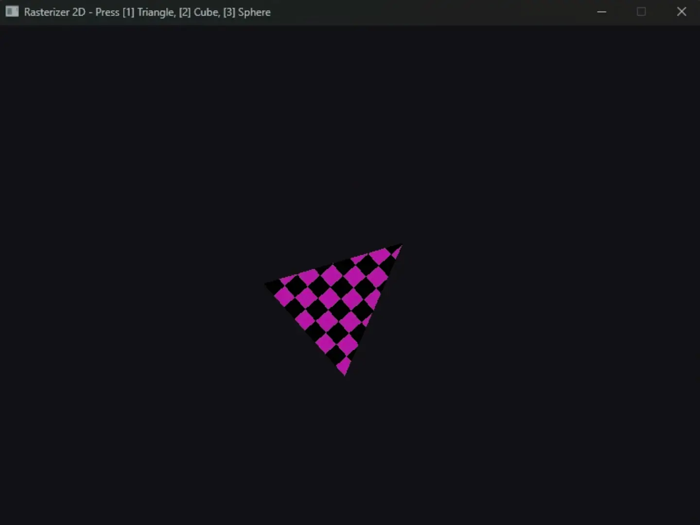

# Rasterizer 2D

A C++ software rasterizer built from scratch using CMake and SDL3.



## Features
- **Math Primitives**: Custom lightweight `Vector2`, `Vector3`, `Matrix3`, and `Color` structs.
- **Core Canvas**: Framebuffer pixel canvas managing raw color buffers.
- **Platform Layer**: Cross-platform windowing and surface blitting powered by SDL3.
- **Rasterization Pipeline**: Point plotting, Bresenham's line algorithm, edge-function triangle rasterization, and UV texture mapping.
- **Interactive Scenes**: Runtime scene switching (Press `1` for 2D Textured Triangle, `2` for 3D Cube, `3` for 3D Sphere).

## Build & Run

```bash
cmake -B build
cmake --build build --config Debug
./build/Debug/rasterizer.exe